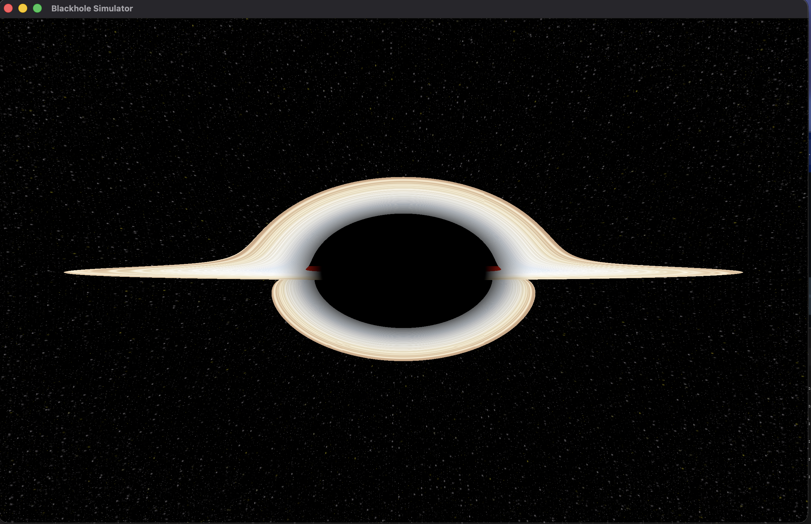
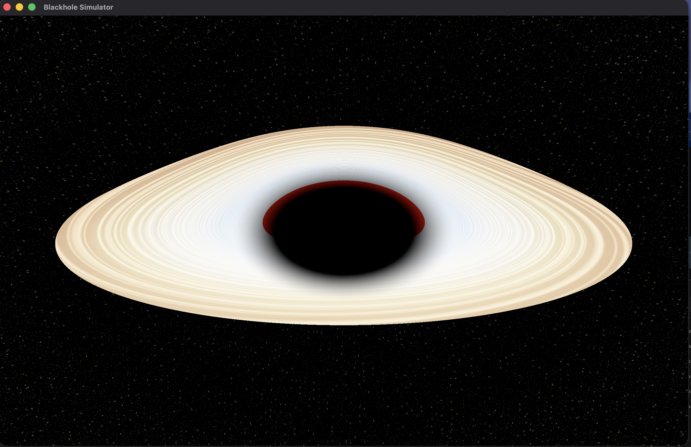

# BlackholeSimulator — Real-time GPU Black Hole Visualization

A real-time general-relativistic black hole renderer built entirely on Apple Metal Compute Shaders and Swift. Simulates gravitational lensing, a glowing accretion disk with Doppler beaming/gravitational redshift, starfield distortion, and post-processing bloom — all running at 60fps on Apple Silicon.

## Screenshots

| Near edge-on view | Tilted view |
|:---:|:---:|
|  |  |

When the app launches successfully you should see:
- A **dark central disk** (the shadow / photon sphere)
- A **bright glowing ring** of hot gas (the accretion disk)
- Stars near the center appear **warped and bent** (gravitational lensing)
- One side of the disk is **brighter/bluer** than the other (Doppler beaming — approaching side)

## System Requirements

| Requirement | Minimum |
|---|---|
| OS | macOS 13+ (Ventura) |
| Chip | Apple M1 or later (Metal 3+, GPU compute support) |
| Display | 1920x1080 or higher |

## How to Build and Run

### Prerequisites

- macOS 13 or later, Apple Silicon (M1 or later)
- Xcode command line tools (`xcode-select --install`) — provides `swiftc`, `metal`, and `metallib`

### Build

```bash
cd ~/computer/local_ai/aqua/qwen36/BlackholeSimulationV1
./direct_build.sh Debug        # or: ./direct_build.sh Release
```

The script compiles the Metal shaders into `Shaders.metallib`, compiles the Swift sources, and assembles the app bundle at:

```
build/BlackholeSimulator.app
```

The shader library is precompiled and embedded in the bundle, so **rebuild after any `.metal` change**.

### Run

The app loads its shaders from its own bundle, so it can be launched from any working directory:

```bash
killall BlackholeSimulator 2>/dev/null; sleep 1   # kill any stale instance
./build/BlackholeSimulator.app/Contents/MacOS/BlackholeSimulator &   # from the project root
```

or simply:

```bash
open build/BlackholeSimulator.app
```

While running, **drag the mouse** to orbit the camera around the black hole.
The window title shows the live FPS. To stop the app, run `killall BlackholeSimulator` or close the window.

## What It Simulates — The Physics

### Schwarzschild Black Hole

This simulates a **non-rotating (Schwarzschild)** black hole. The Schwarzschild radius is:

    r_s = 2GM / c²

For a 10-solar-mass black hole, that is approximately 29.5 km in reality. In our coordinate system, we scale so that `r_s = 4` simulation units for a good on-screen size.

### Gravitational Lensing (Ray Bending)

Instead of solving full null geodesics of the Schwarzschild metric, this uses an **Euler-integration approximation** of light deflection:

```
r   = |pos|
n   = -normalize(pos)           // unit vector toward BH
a   = 1.5 * rs / (r * r * r)   // post-Newtonian bending coefficient
dir = normalize(dir + n * a * dt)
```

This is derived from the post-Newtonian limit of GR where the deflection angle of light passing a mass M at impact parameter b is approximately `Δθ ≈ 4GM / (c² b)`. The coefficient `1.5 * rs` is tuned to reproduce visually convincing lensing including the Einstein ring.

At each integration step, the ray direction is perturbed toward the black hole, producing the characteristic bending. Rays that cross `r < 0.9 * r_s` (the photon sphere is at `1.5 * r_s`, event horizon at `r_s`) are absorbed and contribute black.

### Event Horizon Shadow

The "shadow" isn't a solid object — it's the set of pixel-rays that get captured before escaping. Because light rays bend, the apparent shadow is **larger than the event horizon** — roughly `≈ 2.6 * r_s` in angular diameter, matching the famous M87* EHT image.

### Accretion Disk

The accretion disk is a thin equatorial plane (y=0) extending from `r_in` to `r_out`. Ray-disk intersection is detected by **checking for a sign change in y between consecutive steps**:

    prevPos.y * pos.y < 0  → y=0 crossing detected

Then interpolating the exact hit point:

    t = prevPos.y / (prevPos.y - pos.y)
    hit = prevPos + t * (pos - prevPos)

### Disk Temperature and Color (Blackbody Radiation)

The disk temperature follows a power-law profile based on radius (simplified thin-disk model):

    T(r) = T_in * (r_in / r)^0.75

where `T_in` is 8000K (inner edge) cooling down to cooler outer regions. The actual color is computed using a **blackbody color temperature lookup** (approximation of Planck's law mapped to RGB).

Typical temperatures:
- Inner edge (~6 r_g): ~8000K (white-blue, hottest)
- Middle: ~4000-5000K (white-yellow)
- Outer edge (~36 r_g): ~2000-3000K (orange-red)

### Relativistic Effects on the Disk

Two key relativistic effects modulate the disk brightness:

**1. Doppler Beaming (rotation):**
The inner parts of the disk orbit at relativistic speeds. The approaching side appears brighter and the receding side dimmer.

    beta = 0.45                         // orbital speed = 45% of c
    phi = atan2(z, x)                   // azimuthal angle
    D = sqrt(1 - beta²) / (1 + beta*cos(phi))   // Doppler factor

Brightness modulated by `D⁴` (relativistic beaming). Temperature modulated by `D` (transverse Doppler + longitudinal Doppler shift).

**2. Gravitational Redshift:**
Photons climbing out of the deep gravitational well lose energy:

    redshift_factor = sqrt(1 - rs / r)

Photons emitted near the inner disk are significantly redshifted.

### Post-Processing

**Bloom:** Bright pixels (luminance > 0.8) are extracted, Gaussian-blurred (13-tap kernel, sigma=2.0, separable horizontal then vertical pass), and recombined with the original scene at 50% intensity.

**Tone Mapping:** ACES filmic curve applied to the combined image:

    color = (color * (2.51 * color + 0.03)) / (color * (2.43 * color + 0.59) + 0.14)

**Gamma Correction:** Final 2.2 gamma for sRGB display.

## Project Structure

```
BlackholeSimulator/
├── BlackholeSimulator/
│   ├── Shaders/
│   │   ├── CommonTypes.metal          # Shared structs (Params, Camera)
│   │   ├── Starfield.metal           # Procedural starfield + blackbody color
│   │   ├── RayMarcher.metal          # Main ray marching + lensing + disk hit
│   │   ├── AccretionDisk.metal       # Disk helper functions
│   │   ├── PostProcess.metal         # Bloom + tone mapping + gamma
│   │   └── Blit.metal               # Final screen blit
│   ├── Sources/
│   │   ├── SimulationParams.swift    # SimParams struct + SimState manager
│   │   ├── Renderer.swift            # Metal pipeline: command buffers, encode, present
│   │   └── Camera.swift              # Camera orbit, mouse/touch handling
│   ├── SupportingFiles/
│   │   ├── AppDelegate.swift         # macOS app lifecycle
│   │   ├── ViewController.swift      # MetalView hosting + key handling
│   │   └── main.swift               # App entry point
│   └── Package.swift                 # Swift package manifest
├── build/
│   └── BlackholeSimulator.app/        # Built application bundle
├── direct_build.sh                   # Standalone build script (no Xcode needed)
└── README.md                         # This file
```

## Rendering Pipeline

```
For each frame:
  1. Camera.swift  →  update camera position/orientation (orbit on mouse drag)
  2. SimState       →  update params (time++ at 60fps)
  3. RayMarcher.metal  →  per-pixel ray march (compute shader)
     For each pixel (width × height threads):
       a. Generate camera ray through pixel
       b. March ray, bending direction at each step (gravitational lensing)
       c. Detect accretion disk crossing (y=0 plane test)
       d. If disk hit: compute color w/ blackbody + Doppler + redshift
       e. If absorbed (r < 0.9*rs): write black
       f. If escaped (r > 200): sample starfield with bent direction
  4. Bloom pipeline (if enabled):
     a. bloom_extract()     → threshold bright pixels
     b. gaussian_blur(H)    → horizontal blur pass
     c. gaussian_blur(V)    → vertical blur pass
     d. bloom_combine()     → add bloom to scene + ACES tone map + gamma
  5. Blit.metal          → copy to drawable texture
  6. Renderer            → present drawable
```

## Key Parameters

| Parameter | Value | Description |
|---|---|---|
| rs | 4.0 | Schwarzschild radius (in sim units) |
| disk_r_in | 3.0 * rs | Inner disk radius (ISCO for Schwarzschild ≈ 3 rs) |
| disk_r_out | 15.0 * rs | Outer disk radius |
| camera position | (0, 4, -22) | Angled view above and behind |
| step count | 512 | Ray marching iterations |
| escape radius | 200.0 | Max ray distance before starfield sampling |
| absorption radius | 0.9 * rs | Below photon sphere — ray captured |

## Known Approximations

This is an artistic/scientific visualization, not a precision numerical relativity code:
- Ray bending uses **post-Newtonian approximation**, not exact Schwarzschild null geodesics
- The accretion disk is treated as a **thin plane** (real disks have thickness)
- Disk temperature uses a **simplified power-law** rather than full radiative transfer
- The black hole is **non-rotating** (Schwarzschild, not Kerr)
- No frame-dragging or Lense-Thirring precession

For rigorous simulations, see:
- GRay (Brewin 2010): gray.physics.monash.edu
- BHOSS (Chan et al. 2008): arXiv:0802.0757
- L'Expression du Noir: expressiondunoir.com

## Author

Built with Apple Metal Compute Shaders on macOS. Inspired by the Event Horizon Telescope M87* image (2019) and Interstellar (2014, Gyllenborg & Kippenhahn-style visualization).
